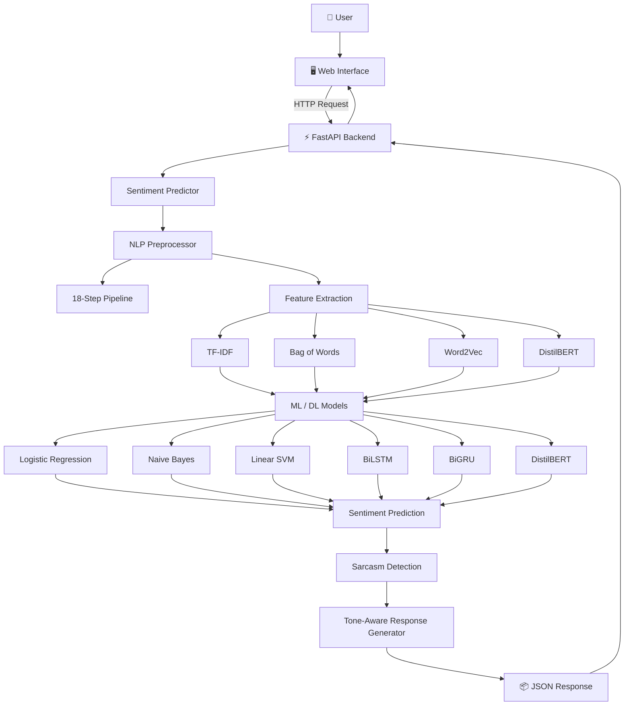

# 🤖 SentimentAI — End-to-End NLP Sentiment Analysis & Tone-Aware Chatbot

<p align="center">
  <b>Multi-Model Sentiment Analysis • NLP Pipeline Visualization • Sarcasm Detection • Adaptive Chatbot • REST API</b>
</p>

<p align="center">
  
  
  
  
  
</p>

---

## 📌 Overview

**SentimentAI** is an end-to-end **Natural Language Processing (NLP)** system designed to analyze user text, classify sentiment, detect potential sarcasm, and generate responses according to the detected emotional tone.

The project combines **classical Machine Learning, Deep Learning, and Transformer-based NLP models** into a unified pipeline.

Instead of treating NLP preprocessing as a black box, SentimentAI provides an **interactive pipeline inspector** that shows how raw user text is transformed at every stage before reaching the sentiment classifier.

### 🎯 Main Objectives

* Classify text as **Positive, Neutral, or Negative**
* Compare multiple ML and DL approaches
* Perform advanced NLP preprocessing
* Visualize each preprocessing stage
* Detect potential sarcastic expressions
* Generate sentiment-aware chatbot responses
* Provide confidence scores and class probabilities
* Expose predictions through a **FastAPI REST API**
* Provide an interactive web-based interface

---

# ✨ Key Features

### 🧠 Multi-Model Sentiment Engine

Supports multiple approaches:

* Logistic Regression
* Multinomial Naive Bayes
* Linear SVM
* Bidirectional LSTM
* Bidirectional GRU
* DistilBERT

### 🔍 18-Step NLP Pipeline

The system provides a transparent view of the complete preprocessing process:

1. Raw Input
2. HTML Stripping
3. URL Removal
4. @Mention Removal
5. Hashtag Normalization
6. Emoji Demojization
7. Case Normalization
8. Contraction Expansion
9. Slang Translation
10. Punctuation Cleaning
11. Whitespace Normalization
12. Tokenization
13. Sentiment-Aware Stopword Filtering
14. Lemmatization
15. Stemming
16. Length Filtering
17. Vectorization
18. Sentiment Classification

### 🎭 Sarcasm Detection

The chatbot uses heuristic rules to identify potential sarcasm based on:

* Sarcastic phrases
* Contradictory sentiment
* Negation
* Contrast words
* Excessive punctuation
* Common ironic expressions

Example:

> "Oh great, another bug!"

The system can identify the positive-looking phrase while considering the surrounding negative context.

### 💬 Tone-Aware Chatbot

The response generator adapts its response according to the predicted sentiment.

| Sentiment   | Response Tone                  |
| ----------- | ------------------------------ |
| 😊 Positive | Happy & Appreciative           |
| 😐 Neutral  | Informative & Balanced         |
| 😞 Negative | Empathetic & Solution-Oriented |

### 📊 Model Evaluation

The training pipeline generates:

* Accuracy
* Precision
* Recall
* F1-Score
* AUC-ROC
* Confusion matrices
* Model comparison charts
* JSON evaluation reports

### ⚡ REST API

The application provides a FastAPI backend with:

* Single-text prediction
* Batch prediction
* Confidence scores
* Probability distributions
* Pipeline information
* Structured JSON responses
* Swagger/OpenAPI documentation

---

# 🏗️ System Architecture



---

# 🔄 NLP Preprocessing Pipeline

SentimentAI processes raw text through several normalization and linguistic transformation stages.

### Example

**Input:**

```text
OMG!! I LOVE this update 😍 #awesome
```

### Processing

```text
Raw Text
   ↓
HTML / URL Removal
   ↓
Mention & Hashtag Processing
   ↓
Emoji → Text
   ↓
Lowercase
   ↓
Contraction Expansion
   ↓
Slang Translation
   ↓
Punctuation Cleaning
   ↓
Tokenization
   ↓
Stopword Filtering
   ↓
Lemmatization
   ↓
Stemming
   ↓
Vectorization
   ↓
Sentiment Classification
```

### Example Transformations

| Technique             | Example                             |
| --------------------- | ----------------------------------- |
| Lowercasing           | `AMAZING → amazing`                 |
| Emoji Processing      | `😍 → smiling_face_with_heart_eyes` |
| Slang Translation     | `tbh → to be honest`                |
| Contraction Expansion | `can't → cannot`                    |
| Hashtag Normalization | `#awesome → awesome`                |
| Lemmatization         | `running → run`                     |
| Stemming              | `studies → studi`                   |

---

# 🧮 Feature Engineering

The project supports multiple text representation techniques.

## 1. Bag of Words

Represents text using word or n-gram frequencies.

```text
Text → Token Frequencies → Numerical Vector
```

Supports:

* Unigrams
* Bigrams
* Configurable vocabulary size

---

## 2. TF-IDF

TF-IDF represents words according to their importance within documents.

Configuration includes:

* Up to 15,000 features
* Unigrams + bigrams
* Sublinear term-frequency scaling
* Document-frequency filtering

---

## 3. Word2Vec

The project uses Word2Vec embeddings to represent words as dense numerical vectors.

Configuration:

```text
Embedding Dimension: 100
Window Size: 5
Training Method: Skip-Gram
Negative Sampling: Enabled
```

Document representations are generated by pooling word embeddings.

---

## 4. DistilBERT

The project uses:

```text
distilbert-base-uncased
```

DistilBERT provides contextual representations that can capture the meaning of words based on their surrounding context.

---

# 🤖 Machine Learning Models

## Classical Machine Learning

### Logistic Regression

Used for multi-class sentiment classification with:

* L2 regularization
* Class balancing
* Hyperparameter optimization

### Multinomial Naive Bayes

A probabilistic classifier commonly used for text classification.

### Linear SVM

Uses a maximum-margin decision boundary for classification.

The SVM predictions can be calibrated to provide probability estimates.

---

# 🧠 Deep Learning Models

## Bidirectional LSTM

The BiLSTM processes sequences in both forward and backward directions to capture contextual information.

Example architecture:

```text
Input
 ↓
Embedding Layer
 ↓
Bidirectional LSTM
 ↓
Dropout
 ↓
Fully Connected Layer
 ↓
Sentiment Class
```

---

## Bidirectional GRU

BiGRU provides bidirectional contextual processing while generally using fewer parameters than LSTM architectures.

---

# 🤗 Transformer Model

## DistilBERT

The project also supports transformer-based sentiment classification using:

```text
distilbert-base-uncased
```

Training can include:

* Learning-rate warmup
* Weight decay
* Early stopping
* Hugging Face Trainer API

---

# 🎭 Sarcasm Detection

SentimentAI includes a rule-based sarcasm detection layer.

### Example

```text
Input:
"Oh great, another software bug!"

Base sentiment:
Positive

Sarcasm:
Detected

Adjusted interpretation:
Negative
```

The system looks for:

* `"oh great"`
* `"yeah right"`
* `"just wonderful"`
* `"as if"`
* `"shocking"`
* Contradictory positive and negative expressions
* Negation
* Excessive punctuation
* Other predefined ironic patterns

> Note: The sarcasm component is heuristic/rule-based and should not be interpreted as a general-purpose sarcasm model.

---

# 💬 Adaptive Response Generation

The chatbot adjusts its response according to the detected sentiment.

### Positive

```text
Sentiment: Positive
Tone: Happy
Response: Warm and enthusiastic
```

### Negative

```text
Sentiment: Negative
Tone: Empathetic
Response: Supportive and solution-focused
```

### Neutral

```text
Sentiment: Neutral
Tone: Informative
Response: Balanced and helpful
```

---

# 📊 Evaluation

The system automatically generates evaluation artifacts inside the `logs/` directory.

```text
logs/
├── cm_BiGRU.png
├── cm_BiLSTM.png
├── cm_BoW + LogisticRegression.png
├── cm_TF-IDF + logistic_regression.png
├── cm_TF-IDF + naive_bayes.png
├── cm_TF-IDF + svm.png
├── evaluation_results.json
└── model_comparison.png
```

### Evaluation Metrics

* Accuracy
* Precision
* Recall
* F1-Score
* AUC-ROC
* Confusion Matrix

> **Important:** Reported benchmark results should be interpreted only after confirming that the evaluation uses a properly separated, unseen test set and that no preprocessing, feature extraction, or model-selection step leaks information from the test data.

---

# 📁 Project Structure

```text
SentimentAI/
│
├── api/
│   └── app.py
│
├── chatbot/
│   ├── predictor.py
│   └── response_generator.py
│
├── preprocessing/
│   └── text_cleaner.py
│
├── features/
│   └── feature_extractor.py
│
├── models/
│   ├── classical_models.py
│   └── deep_models.py
│
├── data/
│   └── dataset.csv
│
├── logs/
│   ├── confusion_matrices/
│   ├── evaluation_results.json
│   └── model_comparison.png
│
├── frontend/
│   └── ...
│
├── requirements.txt
├── README.md
└── LICENSE
```

---

# 🛠️ Technologies Used

| Technology                | Purpose                   |
| ------------------------- | ------------------------- |
| Python                    | Core programming language |
| FastAPI                   | REST API backend          |
| PyTorch                   | Deep learning models      |
| Hugging Face Transformers | DistilBERT                |
| Scikit-learn              | Classical ML & evaluation |
| NLTK                      | Tokenization & stemming   |
| spaCy                     | Lemmatization             |
| Gensim                    | Word2Vec embeddings       |
| Pandas                    | Data processing           |
| NumPy                     | Numerical computation     |
| Matplotlib                | Visualization             |
| HTML/CSS/JavaScript       | Web interface             |

---

# ⚙️ Installation

## 1. Clone the Repository

```bash
git clone https://github.com/YOUR_USERNAME/SentimentAI.git
cd SentimentAI
```

## 2. Create a Virtual Environment

### Windows

```bash
python -m venv venv
venv\Scripts\activate
```

### Linux / macOS

```bash
python3 -m venv venv
source venv/bin/activate
```

## 3. Install Dependencies

```bash
pip install -r requirements.txt
```

## 4. Download NLP Resources

Depending on your implementation, install the required NLTK and spaCy resources.

Example:

```bash
python -m spacy download en_core_web_sm
```

---

# 🏋️ Training

Train the models using the project's training script:

```bash
python train.py
```

The trained models and evaluation results will be stored according to the project configuration.

> Update the command above if your repository uses a different training entry point.

---

# 🚀 Running the Application

Start the FastAPI server:

```bash
uvicorn api.app:app --reload
```

The API will normally be available at:

```text
http://127.0.0.1:8000
```

FastAPI automatically provides interactive API documentation at:

```text
/docs
```

---

# 🔌 REST API

## Prediction Endpoint

```http
POST /api/predict
```

### Example Request

```json
{
  "text": "I really love this application!"
}
```

### Example Response

```json
{
  "sentiment": "positive",
  "confidence": 0.9821,
  "sarcasm_detected": false,
  "tone": "happy"
}
```

The exact response fields may vary depending on the current API implementation.

---

# 🖥️ Web Interface

The frontend provides an interactive interface for:

* Entering text
* Viewing sentiment
* Viewing confidence
* Inspecting class probabilities
* Checking sarcasm detection
* Viewing the NLP preprocessing pipeline
* Comparing stemming and lemmatization
* Viewing model information
* Reading generated chatbot responses

---

# 📈 Example

### Input

```text
The new update is absolutely amazing! 😍
```

### Output

```text
Sentiment: Positive
Confidence: 98.21%
Sarcasm: Not Detected
Tone: Happy
```

### Chatbot Response

```text
That's great to hear! 😊
Would you like to share more about your experience?
```

---

# 🔬 Project Highlights

### NLP

* Text normalization
* Tokenization
* Stopword filtering
* Lemmatization
* Stemming
* Emoji processing
* Slang normalization
* Contraction expansion

### Machine Learning

* Logistic Regression
* Naive Bayes
* Linear SVM
* TF-IDF
* Bag of Words

### Deep Learning

* BiLSTM
* BiGRU
* Word embeddings

### Transformers

* DistilBERT
* Contextual embeddings
* Transformer fine-tuning

### Application Development

* FastAPI
* REST API
* Interactive web interface
* Real-time prediction
* JSON-based communication

---

# 🎓 Academic Relevance

This project demonstrates practical knowledge of:

* Natural Language Processing
* Machine Learning
* Deep Learning
* Transformer architectures
* Feature engineering
* Model evaluation
* API development
* Full-stack AI application development

It can be used as an academic **CSE / AI & ML final-year project** and can be extended with additional datasets, multilingual NLP, advanced sarcasm models, and production deployment.

---

# 🔮 Future Enhancements

Potential improvements include:

* 🌐 Multilingual sentiment analysis
* 🎙️ Speech-to-text sentiment analysis
* 📱 Mobile application
* 🧠 Neural sarcasm detection
* 😊 Emotion classification beyond sentiment
* 📊 Real-time sentiment dashboards
* 🌍 Multilingual chatbot responses
* 🔐 User authentication
* ☁️ Cloud deployment
* 🐳 Docker containerization
* 📈 Continuous model monitoring
* 🔄 Online model updating
* 💬 Conversation history and context awareness

---

# ⚠️ Limitations

* Sarcasm detection is currently heuristic/rule-based.
* Sentiment quality depends heavily on the training dataset.
* Different domains may require domain-specific fine-tuning.
* Very high evaluation scores should be validated on an independent unseen test set.
* Transformer models may require more computational resources than classical models.

---

# 📜 License

This project is licensed under the **MIT License**.

See the `LICENSE` file for more information.

---

# 👨‍💻 Author

P.VAMSI KRISHNA

CSE – Artificial Intelligence & Machine Learning.


# ⭐ Acknowledgements

* Scikit-learn
* PyTorch
* Hugging Face Transformers
* NLTK
* spaCy
* Gensim
* FastAPI

---

## ⭐ If you find this project useful

Give the repository a ⭐ and feel free to explore, modify, and improve the project.
